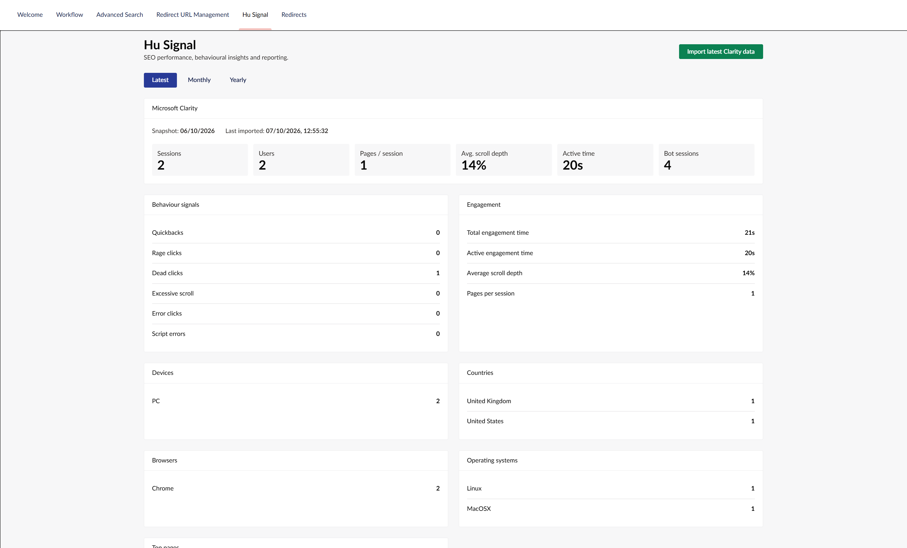
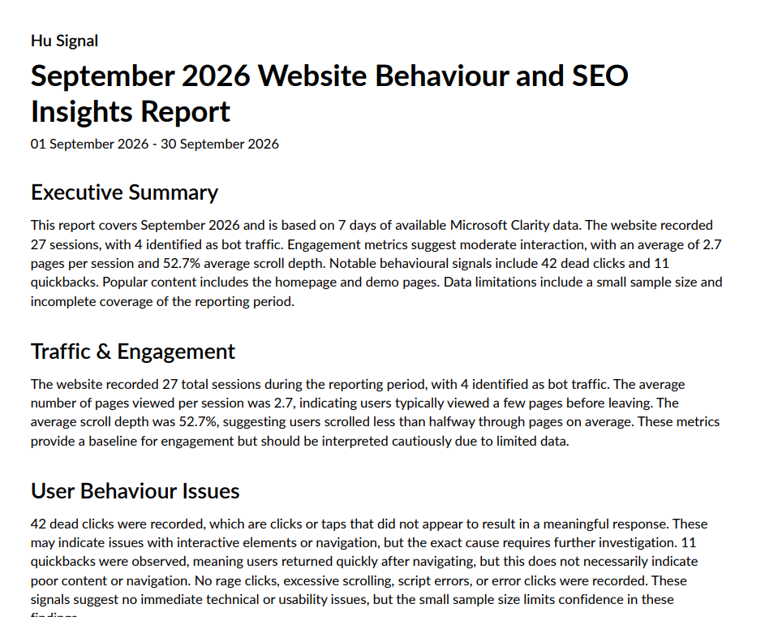
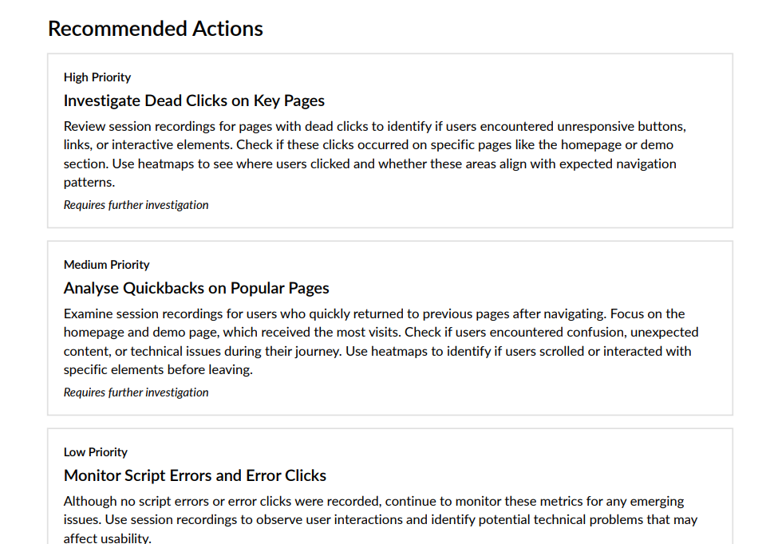

# HuSignal

HuSignal brings Microsoft Clarity behavioural analytics into the Umbraco backoffice, helping editors and website teams understand how visitors are interacting with their site without having to leave Umbraco.

It collects Microsoft Clarity data over time, presents behavioural and traffic insights inside the backoffice, and can generate AI-assisted reports that turn the collected data into clear observations and practical recommendations.

HuSignal is designed to help surface areas worth investigating while avoiding unsupported conclusions about user behaviour, SEO performance or the causes behind behavioural signals.

## Features

### Microsoft Clarity integration

Connect HuSignal to Microsoft Clarity using your Clarity API token.

HuSignal retrieves Clarity data and stores daily snapshots so that behavioural information can be accumulated and reviewed over longer reporting periods.

### Analytics inside Umbraco

View Microsoft Clarity data directly from the Umbraco backoffice.

HuSignal brings together useful behavioural and audience information including:

- Sessions
- Pages per session
- Scroll depth
- Dead clicks
- Rage clicks
- Quickbacks
- Excessive scrolling
- Error clicks
- Script errors
- Popular pages
- Referrers
- Countries
- Devices
- Browsers
- Operating systems

This provides editors and website teams with a convenient overview of how people are interacting with the site.

### Behavioural signals

HuSignal highlights behavioural signals captured by Microsoft Clarity that may indicate areas worth investigating.

For example, a dead click tells you that a visitor clicked or tapped something that did not appear to produce a meaningful response. It does not necessarily mean that a link is broken.

HuSignal treats these metrics as signals rather than automatically assigning a cause.

Where further investigation is appropriate, Microsoft Clarity session recordings and heatmaps can be used to understand what visitors were doing and determine whether a change is required.

### AI-assisted reports

HuSignal can generate structured reports from the Microsoft Clarity data accumulated for a selected reporting period.

Reports provide plain-English analysis covering areas such as:

- Traffic and engagement
- User behaviour issues
- Popular content
- Audience and technology
- Referral traffic
- Prioritised recommendations
- Data limitations

The reporting system is deliberately evidence-based. The AI is instructed not to invent causes, conversions, rankings, search queries, user intent or other information that cannot be established from the supplied Clarity data.

When the available data identifies a behavioural signal but cannot establish its cause, recommendations direct the reader towards further investigation using relevant Microsoft Clarity session recordings or heatmaps.

### PDF reports

Generated reports can be presented as PDF documents, making it easier to share behavioural insights with clients, stakeholders and other members of your team.

## Why HuSignal?

Microsoft Clarity provides useful information about how visitors interact with a website, but interpreting behavioural metrics can require additional analysis.

HuSignal brings that information closer to the people managing the website.

Instead of treating metrics such as dead clicks, quickbacks or scroll depth as definitive evidence of a problem, HuSignal helps identify signals worth investigating and provides practical next steps.

The aim is not to replace Microsoft Clarity.

HuSignal complements it by bringing its data into Umbraco, accumulating that data over time, and helping turn it into understandable insights that can guide further investigation.

## Requirements

- Umbraco CMS 17
- Microsoft Clarity project
- Microsoft Clarity API token

AI report generation additionally requires access to a compatible LLM API configured for HuSignal.

## Installation

Install HuSignal from NuGet:

```bash
dotnet add package HuSignal
```

Alternatively, install the package through the NuGet package manager in your development environment.

After installation, build and start your Umbraco application.

HuSignal will add its backoffice functionality to Umbraco.

## Configuration

HuSignal is configured through your Umbraco project's `appsettings.json` file.

Add a `HuSignal` section containing your Microsoft Clarity API token and, if you want to use AI-assisted reports, the connection details for your LLM API.

```json
{
  "HuSignal": {
    "MsClarityToken": "YOUR_CLARITY_TOKEN",
    "AI": {
      "BaseUrl": "http://localhost:5000/v1/chat/completions",
      "ApiKey": "YOUR_API_KEY",
      "Model": "qwen3:8b",
      "TimeoutSeconds": 300,
      "Temperature": 0.3,
      "TopP": 0.9,
      "ContextSize": 16000
    }
  }
}
```

### Microsoft Clarity

Set `MsClarityToken` to the API token for your Microsoft Clarity project.

```json
"MsClarityToken": "YOUR_CLARITY_TOKEN"
```

HuSignal uses this token to retrieve Microsoft Clarity analytics data for your website.

### AI-assisted reports

The `AI` section configures the LLM API used to generate HuSignal's behavioural and SEO insight reports.

```json
"AI": {
  "BaseUrl": "http://localhost:5000/v1/chat/completions",
  "ApiKey": "YOUR_API_KEY",
  "Model": "qwen3:8b",
  "TimeoutSeconds": 300,
  "Temperature": 0.3,
  "TopP": 0.9,
  "ContextSize": 8192
}
```

`BaseUrl` is the chat completions endpoint for your LLM API.

`ApiKey` is the API key required by that endpoint.

`Model` identifies the model that should be used to generate reports. The example above uses `qwen3:8b`.

`TimeoutSeconds` controls how long HuSignal will wait for the report to be generated before timing out.

`Temperature` and `TopP` control model generation behaviour.

`ContextSize` specifies the context size supplied to the LLM API.

The AI integration is designed to use a compatible LLM API, allowing HuSignal to work with locally hosted models as well as other compatible LLM services.

For production environments, sensitive values such as your Microsoft Clarity token and AI API key should be stored using an appropriate secrets or environment-variable configuration rather than committed to source control.

## AI report generation

HuSignal supports AI-assisted analysis of the accumulated Microsoft Clarity data.

The AI integration is designed so that report generation is separate from the collection of Clarity analytics.

This allows the report generation service to use a compatible LLM API rather than tying HuSignal to a specific hosted AI provider.

A locally hosted model can therefore be used where the configured LLM API supports it.

The quality of generated reports will depend on the model being used. Models with good instruction-following and structured JSON generation capabilities are recommended.

## Understanding the reports

HuSignal reports distinguish between what the supplied data shows and what requires further investigation.

For example:

**Observation**

A page recorded dead clicks during the reporting period.

**What this means**

Visitors clicked or tapped something that did not appear to produce a meaningful response.

**What it does not mean**

The data alone does not prove that the page contains a broken link, incorrect URL or navigation problem.

**Recommended next step**

Review relevant Microsoft Clarity session recordings and click heatmaps to identify which elements visitors attempted to interact with and what happened before and after those interactions.

This approach is used throughout the reporting system to avoid presenting assumptions as facts.

## Data limitations

Microsoft Clarity behavioural analytics can provide useful evidence about how visitors interact with a website, but it cannot answer every question.

Clarity data alone does not establish:

- Google rankings
- Organic search performance
- Keyword performance
- Search queries
- Conversions or revenue
- Search intent
- Core Web Vitals
- The cause of every behavioural signal

HuSignal reports take these limitations into account and use cautious language when the available sample size or data coverage is limited.

For SEO analysis, HuSignal should therefore be used alongside appropriate search and analytics tools rather than as a replacement for them.

## Privacy

HuSignal integrates with Microsoft Clarity and stores analytics information retrieved through the Clarity API.

Before using Microsoft Clarity on a production website, make sure your implementation complies with the privacy, cookie and consent requirements applicable to your organisation and users.

Refer to Microsoft's current Clarity documentation for information about Clarity's data collection and privacy features.

## Screenshots

### Clarity analytics dashboard



Microsoft Clarity analytics presented inside the Umbraco backoffice.

### AI-assisted report



Behavioural and SEO insights generated from accumulated Clarity data.

### Recommendations



Prioritised recommendations with guidance for further investigation using Microsoft Clarity.

## Issues and feedback

Found a bug or have an idea for HuSignal?

Please open an issue on the [HuSignal GitHub issue tracker](https://github.com/dwhalley15/hu-signal/issues).

## Contributing

Contributions, bug reports and suggestions are welcome.

If you would like to contribute, please open an issue or pull request on the HuSignal GitHub repository.

License

HuSignal is released under the MIT License.

See LICENSE for details.

Author

David Whalley
Developer at the human tech agency

GitHub

HuSignal is an independent open-source package and is not affiliated with or endorsed by Microsoft or Umbraco.